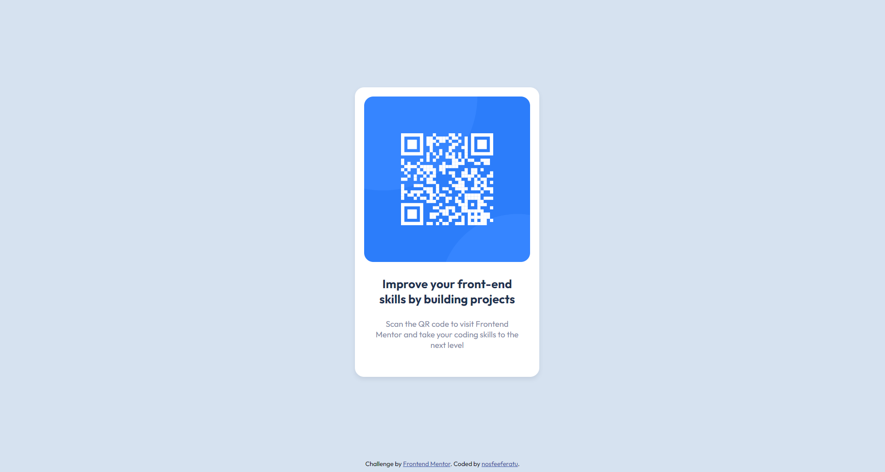

# Frontend Mentor - QR code component solution

This is a solution to the [QR code component challenge on Frontend Mentor](https://www.frontendmentor.io/challenges/qr-code-component-iux_sIO_H). Frontend Mentor challenges help you improve your coding skills by building realistic projects. 

## Table of contents

- [Overview](#overview)
  - [Screenshot](#screenshot)
- [My process](#my-process)
  - [Built with](#built-with)
  - [What I learned](#what-i-learned)
  - [Useful resources](#useful-resources)
- [Author](#author)

**Note: Delete this note and update the table of contents based on what sections you keep.**

## Overview

Almost a month into my journey of learning CSS, my friend introduced me to this website containing challenges that helped him grow his frontend skills. Here is my first attempt at doing one of these challenges.

### Screenshot

## My process

### Built with

- Semantic HTML5 markup
- CSS custom properties

### What I learned

A major learning that I made while working this challenge was how to make a card. It wasn't something I'd used in any of the things I'd tried so far in my learning of HTML and CSS, so I'm delighted to make this new learning.

### Useful resources

- [w3schools](https://www.w3schools.com) - Learnt how to make a card through this incredible website.
- [overapi](https://www.overapi.com) - A handy tool as a newbie to know of all the usable elements and attributes.

## Author

- Frontend Mentor - [@nosfeeferatu](https://www.frontendmentor.io/profile/nosfeeferatu)
